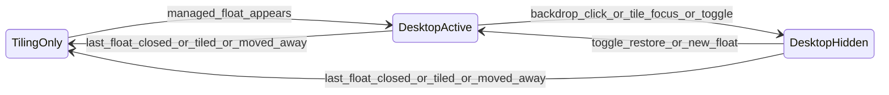

# Hyprdesktop Plugin Implementation Plan

## Goal

Replace the current overlay stack:

- [`config/hypr/lua/floating.lua`](config/hypr/lua/floating.lua) — state, stash, scrim coordination, `follow_mouse` flip, `place_float`
- [`config/quickshell/shell.qml`](config/quickshell/shell.qml) — `omarchy-float-scrim` click catcher
- SUPER+LMB/RMB float drag binds in `floating.lua`

…with a single in-repo plugin at `plugins/hyprdesktop/` that implements your five blueprint areas. **Hide strategy: ghosting** (opacity 0 + no input), not `special:floatstash`.



Per-workspace state is isolated: Workspace 1 can be `TilingOnly` while Workspace 2 is `DesktopActive`.

---

## Repository layout

```
plugins/hyprdesktop/
  CMakeLists.txt          # hyprland-plugins-style build
  README.md               # build + config reference
  src/
    main.cpp              # PLUGIN_INIT / PLUGIN_EXIT
    DesktopMode.hpp/cpp   # per-workspace state machine
    Ghosting.hpp/cpp      # hide/restore via alpha + input block
    InputBackdrop.hpp/cpp # empty-space click interception
    BarDeco.hpp/cpp       # forked from hyprbars barDeco
    CsdPolicy.hpp/cpp     # CSD / blacklist gating
    Layout.hpp/cpp        # bar-aware initial float geometry
    Globals.hpp
  include/                # if needed for Hyprland API headers path
```

Dotfiles integration:

- Extend [`config/hypr/install.sh`](config/hypr/install.sh) (or add `plugins/hyprdesktop/build.sh`) to compile against installed Hyprland headers and install `hyprdesktop.so` to `~/.config/hypr/plugins/`.
- Load in [`config/hypr/hyprland.lua`](config/hypr/hyprland.lua) after static config, before slimmed Lua hooks.

---

## Module 1 — Desktop Mode state engine

**Core struct** (keyed by `PHLWORKSPACE` id):

```cpp
enum class DesktopState { Inactive, Active, Hidden };

struct WorkspaceDesktop {
    DesktopState state = DesktopState::Inactive;
    std::unordered_set<PHLWINDOWREF> managedFloats;
    std::unordered_set<PHLWINDOWREF> ghostedFloats;
};
```

**Managed float definition** (port from current `unmanaged()` in `floating.lua`):

- Must be `floating`, not pinned, not on a special workspace
- Exclude tags: `pip` (and configurable list)
- Exclude classes/titles from config (e.g. Webcam)
- Never manage the plugin's own decorations layer

**Event subscriptions** (modern `Event::bus()`, not deprecated `registerCallbackDynamic`):

| Event | Action |
|-------|--------|
| `window.open` | If managed float on workspace → `enterDesktopMode(ws)`; run layout |
| `window.close` | Recompute; if zero managed floats remain → `exitDesktopMode(ws)` |
| `window.focus` | Raise active float; if focus lands on **tiled** window → `ghostFloats(ws)` (parity with current Lua) |
| `window.float` / tile toggle | Update membership; exit if last float tiled |
| `window.move` (workspace change) | Update old + new workspace states |
| `workspace.active` | Refresh input/focus mode for new workspace |

**Side effects on `Active`:**

- Set `input:follow_mouse = 0` while workspace has visible (non-ghosted) managed floats — same rationale as current [`floating.lua:171-174`](config/hypr/lua/floating.lua).
- Restore previous value on `Inactive`.

**Manual toggle** (replaces SUPER+A):

- Register `hl.plugin.hyprdesktop.toggle_layer` via `HyprlandAPI::addLuaFunction`.
- Bind in Lua: `hl.bind("SUPER + A", hl.plugin.hyprdesktop.toggle_layer)`.
- Logic: if `Hidden` → unghost all; else if `Active` → ghost all.

**Auto-dismiss:** when last managed float is closed, tiled, or leaves workspace → `Inactive`, unghost cleanup, restore `follow_mouse`.

---

## Module 2 — SSD titlebars (hyprbars fork)

Fork [`hyprbars`](https://github.com/hyprwm/hyprland-plugins/tree/main/hyprbars) `barDeco.hpp/cpp` + button rendering into `BarDeco.*`. Do **not** ship a second `hyprbars` plugin alongside it.

**Gating rules** — attach `CHyprBar` decoration only when ALL are true:

1. Window is floating
2. Workspace is `DesktopActive` or `DesktopHidden` (bars visible even when ghosted, or config option to hide bars when ghosted — default: hide bars when ghosted)
3. `CsdPolicy::wantsServerBar(window)` returns true
4. Plugin enabled globally

**Buttons** (defaults matching blueprint):

| Button | Dispatcher |
|--------|------------|
| `-` | minimize / send to minimize dispatcher or pin+opacity hack per Hyprland support |
| `o` | `fullscreen` / `fakefullscreen` toggle |
| `x` | `closewindow` |

Configure via `plugin:hyprdesktop:hyprbars-button` keyword (reuse hyprbars parse logic) or Lua `hl.plugin.hyprdesktop.add_button`.

**Drag without SUPER:** reuse hyprbars `onInputOnDeco` → `handleMovement()` → `mouse:1movewindow` dispatch. This directly replaces SUPER+LMB drag from [`floating.lua:327-328`](config/hypr/lua/floating.lua).

**Float-only bars:** enforce in plugin code (not only window rules) so tiled windows never get decoration extents — avoids the known “invisible bar hitbox on tiled windows” issue from [hyprland-plugins#28](https://github.com/hyprwm/hyprland-plugins/issues/28).

---

## Module 3 — Backdrop input interception

Replace Quickshell scrim with compositor-side handling.

**Primary approach** (no Hyprland core fork):

```cpp
Event::bus()->m_events.input.mouse.button.listen([&](auto& e, Event::SCallbackInfo& info) {
    if (!desktopModeActiveOnFocusedWorkspace()) return;
    if (e.state != WL_POINTER_BUTTON_STATE_PRESSED) return;
    if (surfaceUnderCursorIsManagedWindow()) return;
    ghostFloats(currentWorkspace);
    info.cancelled = true;  // swallow click so no tile gets focus
});
```

**Fallback** if event cancellation is insufficient (clicks still reach tiles): `HyprlandAPI::createFunctionHook` on `CInputManager::processMouseDownNormal` per [Advanced plugin docs](https://wiki.hypr.land/Plugins/Development/Advanced/) — inspect `g_pCompositor->vectorToWindowUnified()` and bail early when over root/empty space.

**Also expose** `hl.plugin.hyprdesktop.dismiss()` for scripted dismiss (replaces `omarchy_float_dismiss()`).

This eliminates:

- [`shell.qml` FloatingWindow scrim](config/quickshell/shell.qml) (lines 15–30)
- Scrim window rule in `floating.lua`
- Scrim filtering in [`Hyprland.qml`](config/quickshell/services/Hyprland.qml)

---

## Module 4 — Ghosting hide mechanics

User chose ghosting over scratchpad. Per-window ghost record:

```cpp
struct GhostRecord {
    float savedAlpha;
    // saved position/size if needed
};
std::unordered_map<PHLWINDOWREF, GhostRecord> ghosts;
```

**On ghost:**

1. Save current alpha (`PHLWINDOW` opacity / rule alpha)
2. Set alpha to `0.0` (via window effect or direct property — prefer registered plugin window effect `hyprdesktop:ghosted` for rule integration)
3. Mark window as input-transparent: set internal no-focus / block flags checked by plugin input paths; optionally register temporary rule `no_focus = true`
4. Transition workspace `Active → Hidden`

**On unghost (toggle / new float / manual restore):**

1. Restore saved alpha
2. Clear ghost flags
3. `Hidden → Active` if any floats remain visible

**Advantages over current stash:** no `special:floatstash` workspace, no `toggle_special` race, no negative-id workspace filtering in [`WorkspaceBar.qml`](config/quickshell/bar/components/WorkspaceBar.qml).

**Risk to mitigate:** ghosted windows must not be focusable via `cyclenext` or keyboard — verify and block in focus hooks if needed.

---

## Module 5 — CSD conflict mitigation

Extend hyprbars' existing check (`!window->m_X11DoesntWantBorders` in hyprbars `onNewWindow`) with layered policy in `CsdPolicy.cpp`:

1. **Wayland xdg-decoration:** if window negotiated `ZXDG_TOPLEVEL_DECORATION_V1_MODE_CLIENT_SIDE`, skip server bar. Read decoration mode from Hyprland's `CXDGDecoration` / window private fields at `window.open` and `window.updateRules`.
2. **XWayland:** keep `m_X11DoesntWantBorders` and override-redirect checks from XWaylandManager.
3. **Class/title blacklist** (config): `plugin:hyprdesktop:csd_blacklist = ^(code|Cursor|electron|.*nautilus.*)$` — never attach bar.
4. **Whitelist override** (optional): force bar on specific classes even if CSD detected.

Register window effects: `hyprdesktop:no_bar`, `hyprdesktop:force_bar` for per-window Lua rules in [`apps.lua`](config/hypr/lua/apps.lua).

---

## Parity items not in blueprint (keep from current config)

| Behavior | Where it lives today | Plugin plan |
|----------|---------------------|-------------|
| Bar-aware centering below Quickshell bar | `place_float`, `BAR_TOP=36` | `Layout.cpp` + config `top_reserved_px = 36` (sync with [`Metrics.qml`](config/quickshell/tokens/Metrics.qml) `barHeight`) |
| SUPER+T smart float toggle | `floating.lua` | Keep thin Lua bind calling `hl.dsp.window.float` + `hl.plugin.hyprdesktop.layout_window()` OR move fully into plugin `float` event |
| Raise float on click | `window.active` | `window.focus` handler |
| Hide on tile focus | `window.active` | `window.focus` handler |
| PiP / pinned exclusions | `unmanaged()` | config + same tag checks |
| `resize_on_border` | `looknfeel.lua` | keep as-is |

---

## Config surface (`plugin:hyprdesktop:*`)

| Key | Default | Purpose |
|-----|---------|---------|
| `enabled` | true | Master switch |
| `top_reserved_px` | 36 | Quickshell bar offset for layout |
| `full_fraction` | 0.95 | Axis "filled monitor" threshold |
| `shrink_fraction` | 0.80 | Shrink full axes to this fraction |
| `ghost_alpha` | 0.0 | Hidden float opacity |
| `hide_on_tile_focus` | true | Parity with current Lua |
| `toggle_bind` | (Lua-side) | SUPER+A |
| `csd_blacklist` | regex list | No double titlebar |
| `excluded_tags` | pip | Skip overlay management |
| Bar colors/heights | hyprbars defaults | SSD appearance |

Example Lua load:

```lua
-- hyprland.lua (after require chain)
hl.plugin.load(os.getenv("HOME") .. "/.config/hypr/plugins/hyprdesktop.so")

hl.config({
  plugin = {
    hyprdesktop = {
      top_reserved_px = 36,
      hide_on_tile_focus = true,
    }
  }
})
```

---

## Dotfiles migration (after plugin works)

**Delete / slim:**

- Remove ~90% of [`floating.lua`](config/hypr/lua/floating.lua) (stash, scrim, follow_mouse, overlay handlers); keep only SUPER+T wrapper if not fully moved to plugin.
- Remove scrim `FloatingWindow` from [`shell.qml`](config/quickshell/shell.qml).
- Remove scrim filter from [`Hyprland.qml`](config/quickshell/services/Hyprland.qml).
- Remove SUPER+LMB/RMB float drag binds (titlebar drag replaces them).
- Remove `floatstash` comments from [`WorkspaceBar.qml`](config/quickshell/bar/components/WorkspaceBar.qml) if no longer relevant.

**Keep unchanged:**

- [`apps.lua`](config/hypr/lua/apps.lua) float window rules (`floating-window`, `pip`)
- [`looknfeel.lua`](config/hypr/lua/looknfeel.lua) `resize_on_border`
- [`focus.lua`](config/hypr/lua/focus.lua) float border rules

---

## Build and version coupling

- Build against the **exact** Hyprland version installed (`__hyprland_api_get_hash()` check, same as hyprbars `main.cpp`).
- Add `plugins/hyprdesktop/CMakeLists.txt` mirroring [hyprland-plugins/hyprbars](https://github.com/hyprwm/hyprland-plugins/tree/main/hyprbars): `HYPRLAND_HEADERS`, `HYPRLAND_LIB`, pkg-config or `hyprland --print-headers-path` if available.
- Document in README: rebuild plugin after every Hyprland upgrade (AUR `hyprland` bump).

---

## Implementation order

Recommended sequence to validate incrementally:

1. **Scaffold** — CMake, PLUGIN_INIT, config registration, load from `hyprland.lua`
2. **DesktopMode engine** — event wiring, per-workspace state, `follow_mouse` toggle
3. **Ghosting** — hide/restore/toggle without titlebars yet
4. **Input backdrop** — replace scrim; verify tile clicks don't leak focus
5. **BarDeco fork** — SSD + drag + buttons, float-only gating
6. **CsdPolicy** — decoration detection + blacklist
7. **Layout** — `place_float` parity for new floats and SUPER+T
8. **Dotfiles cleanup** — remove Lua/scrim; update install script

---

## Testing checklist

- Float opens on WS2 → Desktop Mode active only on WS2; WS1 unchanged
- Click wallpaper → floats ghost; tiles usable; no scrim window in `hyprctl clients`
- SUPER+A → ghost ↔ visible toggle
- Focus tiled window → ghosts (if `hide_on_tile_focus`)
- Close last float → Desktop Mode exits; `follow_mouse` restored
- SUPER+T full-size tile → float shrinks to 80%, centered below bar
- PiP / pinned → never enters overlay; no titlebar
- VS Code / Cursor → no double titlebar (CSD blacklist)
- Kitty / libdecor app → server bar OR no bar based on decoration negotiation
- Hyprland upgrade → plugin hash mismatch gives clear notification (not silent crash)
